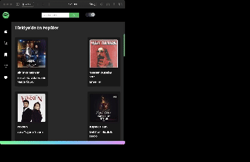

<h1>Spotify Clone Website<h1>

I created a Spotify clone website with shazam api which is used HTML,SCSS,JS and custom shazam API.
-Responsive
-Local Storage
-Dark/Light Mode
-SCSS

<h2>HTML,SCSS,JavaScript<h2>
<h2>Link: <h2>
<h2>API: https://rapidapi.com/apidojo/api/shazam/<h2>

<h2> Screen <h2>

